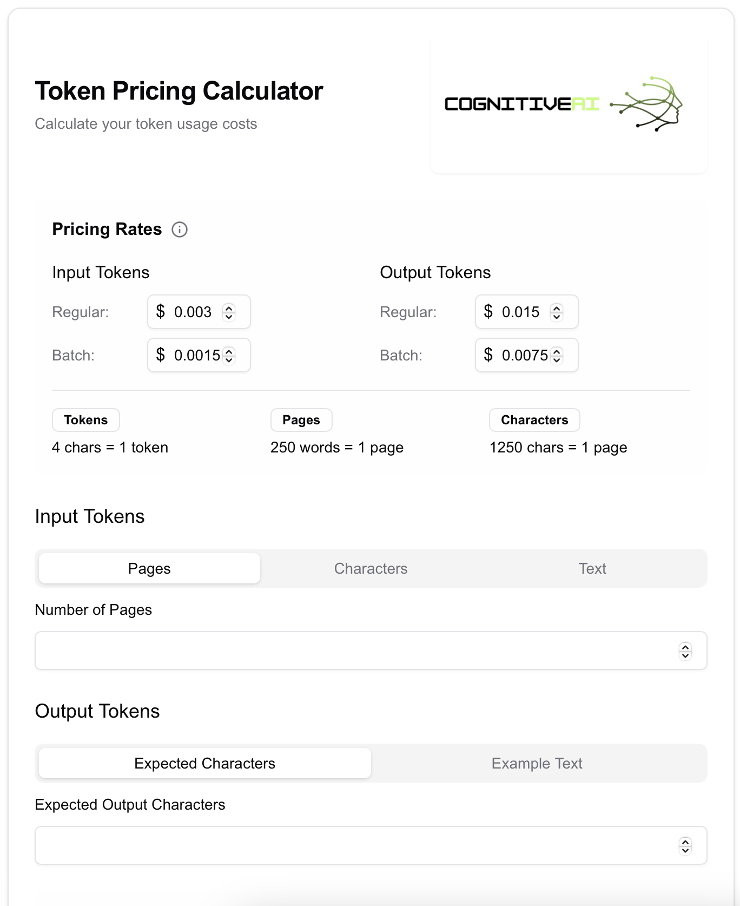

# Token Price Calculator

A React-based calculator for estimating token costs for language model APIs. Built with Next.js, Tailwind CSS, and shadcn/ui.



## Features

- Calculate input and output token costs
- Multiple input methods: pages, characters, or direct text
- Real-time price updates
- Configurable pricing rates
- Responsive design
- Support for regular and batch pricing

## Tech Stack

- Next.js 14
- TypeScript
- Tailwind CSS
- shadcn/ui
- Lucide Icons

## Getting Started

### Prerequisites

- Node.js 18 or later
- npm or yarn

### Installation

```bash
# Clone the repository
git clone https://github.com/YOUR_USERNAME/token-calculator.git

# Navigate to project directory
cd token-calculator

# Install dependencies
npm install

# Start development server
npm run dev
```

Visit `http://localhost:3000`

### Environment Variables

No environment variables required.

## Usage

1. Select input method: pages, characters, or text
2. Enter your content
3. Specify expected output
4. View calculated costs for both regular and batch processing

## Deployment

```bash
# Build for production
npm run build

# Start production server
npm start
```

## Contributing

1. Fork the repository
2. Create your feature branch (`git checkout -b feature/AmazingFeature`)
3. Commit changes (`git commit -m 'Add AmazingFeature'`)
4. Push to branch (`git push origin feature/AmazingFeature`)
5. Open a Pull Request

## License

MIT License - see [LICENSE.md](LICENSE.md)

## Support

For support, email contacto@cognitiveai.cloud